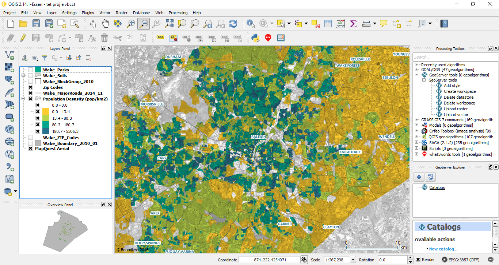
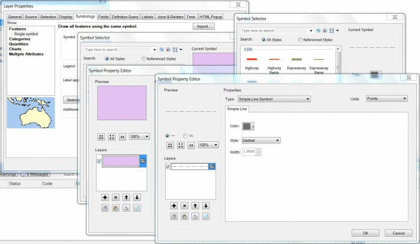

<!-- .slide: data-background-color="#000" data-background-transition="zoom" -->
Direct computer/phone/tablet/phablet/head implant

to

## [**blokk.lassegs.org**](http://blokk.lassegs.org)

---

# Open GIS and the geoeweb
<div align="right">by lassegs with reveal.js</div>


---
A presentation to the tune of the [Cantina theme](https://www.youtube.com/watch?v=kCGPt3XFxJk). 

This is the story of GIS and web maps from a free software praxis perspective. The set up borrows some elements Star Wars, for the lulz.

+ 10:15 Story time
+ 11:00 Recess
+ 11:15 Story time
+ 11:35 Discussion
+ 12:00 Release

Note:
Open Source is model of development, free software is political. 
We find ourselves under the rule of Empire.
We'll meet an animal that looks funny, but is shown to be a great teacher.
In the face of darkness, we discover our own great powers.
Some paternal bonds are revealed. 

---

<!-- .slide: data-background-color="#000" data-background-transition="zoom" -->
<div style="font-weight: 800">
In a galaxy not so far away, neither in time nor space...
</div>


```

 I explore the origins of the hacker culture,including prehistory
 among the Real Programmers, the glory days of the MIT hackers,
 and how the early ARPAnet nurtured  the first network nation.

 I describe the early rise and eventual stagnation of Unix,
 the new hope from  Finland, and how *the last true hacker*
 became the next generation's patriarch. I sketch the way Linux
 and the mainstreaming of the Internet brought the hacker culture 
 from the fringes of public consciousness to its current prominence.


```

<div align="right">by ESR from [Cathedral and the Bazaar](http://www.catb.org/esr/writings/cathedral-bazaar/hacker-history/index.html#id2763962)</div>

Note:
What do I want to show with this? 
Hacker culture is old, and lineages can be traced all the way to the beginning.
It is so old that even the meta level of hackery is old: The hackers' Jargon File can be traced back to a text file
that was circulated on ARPAnet in 1975, but some words are as old as the early 60s. This file contains the definitions of hacker words, it is a dictionary, and
contains words like
Hackers insist that they should not be confused with computer criminals. As RMS says:


---


<p style="text-align:left">[**baroque**](http://www.catb.org/jargon/html/B/baroque.html) <span style="font-size: 0.7em"> *adj.* [common] 	Feature-encrusted; complex; gaudy; verging on excessive. Said of hardware or (esp.) software designs, this has many of the connotations of [elephantine](http://www.catb.org/jargon/html/E/elephantine.html) or [monstrosity](http://www.catb.org/jargon/html/M/monstrosity.html) but is less extreme and not pejorative in itself. In the absence of other, more negative descriptions this term suggests that the software is trembling on the edge of bad taste but has not quite tipped over into it. “Metafont even has features to introduce random variations to its letterform output. Now that is baroque!” See also [rococo](http://www.catb.org/jargon/html/R/rococo.html).
</span></p>


---
<!-- .slide: data-background-color="#000" -->
A tour down the rabbit hole of science in the digital age
 
<iframe data-src="//giphy.com/embed/y55tOswHWvBxC" width="680" height="460" frameBorder="0" class="giphy-embed" allowFullScreen></iframe>

Note:


why should you go down this rabbit hole.
A history of digital mapping. One that tries to lay out a map of mapping, considering
our current situation. A given here is Bacon's statement that 'knowledge is power'.
When we create maps, make visualizations, or even just present, we are in fact creating new worlds. 

So be fully aware that while I try to offer you shoulders to stand on and see further, this is a 'baroque' piece, crammed with details. The presentation shouldn't really be held without ensuring URL distribution. You will also be subjected to my shortcomings, oversights and misunderstandings.


---

...and our complex webs and layers of [infrastructure](http://pubsonline.informs.org/doi/abs/10.1287/isre.7.1.111)...


<iframe data-src="https://map.norsecorp.com/" width="100%" height="768px" frameBorder="0" ></iframe>


---


<!-- .slide: data-background-color="#000" -->
###...where we'll briefly visit...


Note:
How long it will last, basic structure. Again baroque.

Please feel free to interrupt me as we go, then it will seem less like just ranting to myself.
I hope I've managed to strike a balance between a generic overview and a in depth technical presentation, because some of this is advanced computer stuff, while at the same time I dont want to alienate those of you in the audience who have never programmed before.


---

### You, the resistance,
<iframe data-src="//giphy.com/embed/8jdQ5engCKyQM" width="680" height="460" frameBorder="0" class="giphy-embed" allowFullScreen></iframe

Note:
the resistance 

---

<iframe data-src="//giphy.com/embed/l0HlJxqbJG5xKI4KI" width="480" height="328" frameBorder="0" class="giphy-embed" allowFullScreen></iframe>

---


<!-- .slide: source data-background="https://upload.wikimedia.org/wikipedia/commons/thumb/0/00/Jakarta_slumlife71.JPG/1280px-Jakarta_slumlife71.JPG" -->
###Empire <div style="font-size:0.5em">* Buy 1, get 1 free.</div>

---

### the GNU,
<!-- .slide: source data-background="https://upload.wikimedia.org/wikipedia/commons/thumb/4/42/Streifengnu_%28en._Wildebeest%29.JPG/1024px-Streifengnu_%28en._Wildebeest%29.JPG" -->

Note:
the weird animal that turns out to be a powerful teacher.. RMS or the penguin? No, its obviously the GNU.

Before next slide, remind about perspective, story telling and choice of technologies affects worldview. 

---

<!-- .slide: source data-background="http://bturn.com/wp-content/uploads/2011/11/darth-vader-face.jpeg" -->
### ESRI,

Note: 
the guards of the Empire

---


<!-- .slide: source data-background="http://img.lum.dolimg.com/v1/images/open-uri20150608-27674-13oku6w_bb2a0468.jpeg" -->

###Empire


Note: 
A great evil
---


<!-- .slide: source data-background="http://img.lum.dolimg.com/v1/images/open-uri20150608-27674-13oku6w_bb2a0468.jpeg" -->

### Deeply embedded in

#### Cartographic gaze
#### Quantitative techniques
#### IBM sold punch card [technologies used for nazi genocide](https://en.wikipedia.org/wiki/IBM_and_the_Holocaust).

---
<!-- .slide: source data-background="https://upload.wikimedia.org/wikipedia/commons/thumb/6/6b/2011_Horn_of_Africa_famine_Oxfam_01.jpg/800px-2011_Horn_of_Africa_famine_Oxfam_01.jpg" -->

### [Anthropocene](http://www.igbp.net/download/18.316f18321323470177580001401/1376383088452/NL41.pdf) / [Manthropocene](https://www.theguardian.com/commentisfree/2014/oct/20/anthropocene-working-group-science-gender-bias) / [Capitalocene](http://www.jasonwmoore.com/uploads/The_Capitalocene__Part_I__June_2014.pdf) / [Cthulucene](http://www.e-flux.com/journal/75/67125/tentacular-thinking-anthropocene-capitalocene-chthulucene/)
 

Note: 
A scenic perspective has taken hold of our social narrative. The discussion is which one? 

Anthropocene theorists (like chakrabarty 2009) contends that Humans now act with the power of geophysical forces, like tectonic plates or volcanoes, as the geological agent.
Manthropocene was originally a twitter complaint about the Anthropocene scientist working group consisted of "top scientists, climatologists, etc.", and all but one, Men. At the same time it grabs something deeper. Is anthropos really who created this mess, just a flat unqualified Human? Should we make the domination of men over women as Or should the Anthropos be gendered?

Hold on, says the capitalocene-people. The anthropos shouldnt only be qualified by gender, but also by class. Our current ecological crisis has been generated by the logic of capitalist society, where all is divided into Human or Nature (with big H and N). Human here means those who have work, while Nature are both trees, waterfalls but also women, the "naturales", homeless, etc. All will be exploited in the process of capital accumulation, whereas only Humans (with a big H) are paid.   

Chthulucene is a another deep kind of ecological argument. All of these are links. Read them if you wanna be updated. 


---
<!-- .slide: source data-background="https://upload.wikimedia.org/wikipedia/commons/thumb/6/6b/2011_Horn_of_Africa_famine_Oxfam_01.jpg/800px-2011_Horn_of_Africa_famine_Oxfam_01.jpg" -->


---

# Free software

Note: 
There are many who don't see free software as a critique of the production process of what is. 
That is fine. This god has many faces, and fits into many narratives.

There are reasons why I can say that free software is political and not be afraid to scare you off. The number one reason is that it is a very effective method of production. You are all heavy users of free software right now, either if you like it or not. In your toasters, in airplanes, trafic control systems and waterworks, youre reproduction, mobility and fancies are all supported by the infrastructre around you, that is increasingly based on free software. 


---


<!-- .slide: data-background-color="#000" -->

* 1960s - [CGIS](https://en.wikipedia.org/wiki/Canada_Geographic_Information_System). Academic and military use. Rare computers.
* 1970s - Academic and technological pioneers. Not so rare anymore. 
* 1980s - [GRASS GIS](https://grass.osgeo.org/). Spatial database breakthroughs and PCs. Commercialization.
* 1990s - Mapinfo. GPL. More geospatial algorithms. 1998 [google](https://scholar.google.com/scholar?q=history+of+gis+filetype%3Apdf&btnG=&hl=en&as_sdt=0%2C47).
* 2000s - ESRI 35 % of GIS market share. 2004: Google Maps and Open Street map.
* 2010s - ESRI 40 % of GIS market. Web is blossoming.
* 2020s -

Note:
Canadian grandmaster Roger Tomlinson / IBM --> geogratis
GRASS is freely available, and very usable together with QGIS.

1980s saw the breakthrough of 

Norge var tidlig på ARPAnet, da vi hadde seismiske stasjoner for måling av atombombesprenginger i grunnfjellet som også Sovjet er geografisk plassert på.


---

### Alternative view

A whole bunch of map based software by the 2000s.

---

### ArcGIS *is* GIS. 

Note:
Important for building up 
---

<p>
<iframe data-src="//giphy.com/embed/Gt0zE0HOMkTCg" width="400" height="300" frameBorder="0" class="giphy-embed" allowFullScreen></iframe>
</p>

What exactly is it ArcGIS does?

* What?
* How?
* Why?


Note:
Let's just have look at it. What do we see when we use it?
Here I'm offering my shoulders to stand on and see further,
but you'll have to overcome my shortcomings.

---

Open, visualize, analyse and store

* ##~~What?~~
<small> * Big, bad question</small>
* Let's start with How?

---

 ##Opens a spatial database
  * Connects through storage or network
  * Recognizes and indexes information
  * Loads up relevant data from storage to RAM (working memory)
---
 ##Visualizes 
  * Coordinates and layers
  * Styles
  * Handles user interface
---
 ## Analysis / geoprocessing 
 * Measurements and overlays
 * Spatial correlation (Moran's I, etc.)
 * Spatial regression 
 * Network analysis
 * MANY MANY MORE
---

 ## Stores
 * To image
 * As file locally
 * To database remotely
 * As .pdf (to the printer)	

---

This can be replicated!


Note:
RMS was never afraid to admit that much of the GNU toolkit was imitation. imitation is often innovation. he it is done for a higher purpose, giving users freedom

---
The free as in freedom Geographical Information System
## [QGIS](www.qgis.org)

Note:
seriously, if you haven't downloaded it yet, just go do it. mac windows and linux

---
<!-- .slide: source data-background="https://qgis2015.files.wordpress.com/2015/02/1k0a4924.jpg" -->


#### Tool of the trade, basic and advanced
 
<div style="background-color: rgba(255, 255, 255); background-color: rgba(	255, 255,	 255, .2);">

<div>

[QGIS 2015 Nødebo](http://demo.qgis.org/demos/2015/index.html).

Note:
the annual developers conference of qf
ggis 2015. 
like hammer, you cant really build spaceships without them. academically it's still a good idea to introduce students to desktop GIS. i question for how long we should focus on it though. 

soon, with the next generation of web GIS like turf, the desktop can be completely passe.

---


---
###The good

- Handles all types of files
 * .shp, .geojson, .csv, 
   * .sosi  	<small>*maintained by the Norwegian Mapping Authority (Kartverket)</small>
 
- Connects to all kinds of databases
 * Excellent PostGIS database support
	
- Fast: 64bit and multi core support
<small> * Why doesnt ArcGIS have this?</small>
- Awesome plugin system

Note:
Except 
---

* Better dialogues




Note:
When you only need one or two clicks in QGIS, you need to open 3 dialogs and click on 5 buttons to do the same in ArcMap.


---

* Much better color picker


Note:
Basic stuff like colorpicking is important for cartographers, since we deal with esthetics. 

---

###The bad

* Does not handle ArcGIS project file .mxd 
* Lacks many of the advanced geoprocessing algorithms ArcGIS has.<small>*is catching up.</small>
---

<!-- .slide: source data-background="http://bturn.com/wp-content/uploads/2011/11/darth-vader-face.jpeg" -->


<<<<<<< HEAD
> ## Made in his image

Note:
Problematize gender
=======
> ## "Eg er far din"
>>>>>>> 1da8d488f0d457fb8bc568299e1d6d63e658ccca

---

###Paradigm Weakness

* Desktops, desktops everywhere.
* Stiff maps

* Strong user/developer divide

Note:
The omnious, fucking desktop metaphor and the violent real abstraction of the desktop.

---

Ok, so it opens, visualizes, analyzes, stores what?
<h2>What are we mapping?</h2>
# Data?


---
<!-- .slide: source data-background="https://upload.wikimedia.org/wikipedia/commons/thumb/e/ea/Battle_of_Bentonville_map.png/858px-Battle_of_Bentonville_map.png" -->
 
---

<!-- .slide: source data-background="https://upload.wikimedia.org/wikipedia/commons/0/05/Efecto_matrix.jpeg" -->

Note:
A database stores data, it doesnt care which type. In our times databases can be really, really big.
---

## [Capta](https://www.researchgate.net/profile/C_Hinton/publication/42789107_Introducing_information_management_the_business_approach/links/548876d60cf289302e30af94.pdf#page=56) 
not
### data

Note:
Data are a starting point in our mental processing. Capta are the
result of selecting some for attention, or creating some new category –
such as ‘the number of redheaded academics living alone in Grunerløkka’ – or being so surprised by some items of data which pass across our gaze that we begin to pay them attention. 


---
<!-- .slide: source data-background="http://vignette2.wikia.nocookie.net/starwars/images/7/7b/Starkiller_firing.png" -->

<iframe data-src="//giphy.com/embed/2JA0YPswSWXkI" width="900" height="660" frameBorder="0" class="giphy-embed" allowFullScreen></iframe><p><a href="https://giphy.com/gifs/blog-map-social-2JA0YPswSWXkI">via GIPHY</a></p>

Note:
Power is usually visible and more documented. Mapping resistance can be harder and less available.

Minorities are easily made invisible in maps.
---

<!-- .slide: source data-background="http://i.giphy.com/j6iyD03LaUNuU.gif" data-background-transition="zoom" data-transition="zoom" -->


---


Web maps can be many things 
<iframe data-src="https://www.gapminder.org/tools/?embedded=true#_chart-type=bubbles" width="100%" height="700px" frameBorder="0" ></iframe>


---

For the next period, we'll be focusing on pure web maps and try to make one ourselves. 

Now its time for
#recess

---
### [recess animation](http://nyctaxi.herokuapp.com/)

---
<!-- .slide: data-background="http://img.wallpaperfolder.com/f/6537179D1199/was-looking-mr-robot-and.jpg" -->
# Hacker culture /  Culture hacking


---


"In the computer age, code is law."
<p style="font-size: .7em; text-align: right">Lawrence Lessig</p>


---


Note:
Social scientists should heed his warning. What does it mean though? Can inforamtics be understood as applied social science for engineers, designers and builders? 

I'm not saying that everyone needs to be a coder, but a complete lack of digital literacy is nothing to brag about. So if you started University to avoid Excel, good for you, Libreoffice Calc can get boring too, although, it's made with your freedoms in mind. Science is work.

---


A quick walk through of the 
## big 3 
of 
# W3

---
## HTML

Hypertext Markup Language is used to structure content for web browsers.

```
<html>
    <head>
        <title>Page Title</title>
    </head>
    <body>
        <h1>Page Title</h1>
        <p>This is a really interesting paragraph.</p>
    </body>
</html>
```
---

## CSS

Cascading Style Sheets styles the visuals of HTML sites.
```
body {
    background-color: white;
    color: black;
}
```
---
## Javascript

Javascript lets us control and change the web site after it has loaded.


---

<!-- .slide: source data-background="https://www.gnu.org/graphics/listen-quarter.jpg" -->  

---

Standardization takes work and time.
<iframe data-src="//giphy.com/embed/fmGzSnhk5IwX6" width="680" height="460" frameBorder="0" class="giphy-embed" allowFullScreen></iframe

---

The **free** as in **freedom** 
### geoweb stack

---


---


---

## Tiles, tiles everywhere!


<iframe data-src="https://leaflet-extras.github.io/leaflet-providers/preview/" width="100%" height="630" frameBorder="0" allowFullScreen></iframe>

---

## Tile server

Note:
Throws square bitmaps at the client for each zoom level.

Not the case for vector layers. Tiles since 2005 till, transition to vector happening now. While vector is powerful, experience from other fields predicts a continued use for bitmap and vectors. 

---

## Database

---

## [Leaflet](http://www.leafletjs.com)


## [Openlayers](http://www.openlayers.org)

Note: 
adsdklaslkdkas da.
This is a note
---

## ```<div id="map">```

Note:
Both leaflet and openlayers depend on this logic: A "map" div places a map element on the web page.
---

```
<html> <head> <title>Funky title</title> </head>
<body>
	<h1>Funky header</h1>
	<div id="map" style="width: 100%, height: 400px"></div>
		<script>
  		new ol.Map({
    			layers: [
      			new ol.layer.Tile({source: new ol.source.OSM()})
			 ],
   			 view: new ol.View({
     			 center: [0, 0],
    			  zoom: 2
 			   }),
  		  target: 'map'
 		 });
		</script>
</body> </html>
```
---


<iframe data-src="https://darksky.net/25.7743,-80.1937#map-container" width="100%" height="700px" frameBorder="0" ></iframe>

Note:
Openlayers

Some fun with tilesets. 
Hourly and daily forecasts for the next week.
Minute-by-minute “hyperlocal” rain forecasts.
Observations going back decades.

---

### Turf.js

Enables client side geoprocessing by a javascript library for spatial analysis.


#### Geoprocessing is a large part of GIS:

* Calculates area and distance
 * "nearest coffee shop"
* Joining points to polygons
 * "count coffee shops in 1km radius" 

<p style="text-align:right">Check out http://turfjs.org/</p>

---
Make your own map. See the [explanation](http://openlayers.org/en/latest/doc/quickstart.html)

<iframe height='650' scrolling='no' src='//codepen.io/lassegs/embed/yavPvX/?height=652&theme-id=0&default-tab=html,result&embed-version=2' frameborder='no' allowtransparency='true' allowfullscreen='true' style='width: 100%;'></iframe>

Note:
https://codepen.io/lassegs/pen/yavPvX
Make your own
---

Copypasta the code from the previous slide into your 
#### M:/www_docs/index.html 
and you have a map running at
####  http://folk.uio.no/yourusername/

---
Future:
### [IPFS](https://ipfs.io/) and [smart contracts](https://en.wikipedia.org/wiki/Smart_contract)?

---
## Tools

[Sign up for free stuff @ Github Student Developer Pack](https://education.github.com/pack)
</img>
---
## Tools

* https://carto.com/ CartoDB has been renamed Carto and is even more streamlined. Runs as a service, only 250mb free.
* https://knightlab.northwestern.edu/projects/  - nice and easy javascripts for embedding complex maps in web pages.
* http://pixelmap.amcharts.com/ - Simple and fun pixel map editor
* http://systemapic.com/ - Innovative UiO based beta, for sharing and publishing geodata on and to the web

more at http://blokk.lassegs.org
---

## credits, inspirations and resources
http://alignedleft.com/tutorials/d3/fundamentals

Electronic Archeologist blog:
Programming Historian blog: 

---

### Images from
<small>
https://gisunchained.files.wordpress.com/ http://i.giphy.com/j6iyD03LaUNuU.gif http://www.reactiongifs.com/wp-content/gallery/no/john-cleese-no.gif http://i.giphy.com/j6iyD03LaUNuU.gif
http://giphy.com/embed/2JA0YPswSWXkI https://www.gnu.org/graphics/listen-quarter.jpg https://lh6.googleusercontent.com/-xQzmqQweqIM/AAAAAAAAAAI/AAAAAAAABI4/1KObWBs9wVg/s0-c-k-no-ns/photo.jpg http://img.wallpaperfolder.com/f/6537179D1199/was-looking-mr-robot-and.jpg https://qgis2015.files.wordpress.com/2015/02/1k0a4924.jpg https://upload.wikimedia.org/wikipedia/commons/thumb/6/6b/2011_Horn_of_Africa_famine_Oxfam_01.jpg/800px-2011_Horn_of_Africa_famine_Oxfam_01.jpg http://boundlessgeo.com/wp-content/uploads/2016/04/Wake_Pop_density_2.png https://upload.wikimedia.org/wikipedia/commons/e/ea/Battle_of_Bentonville_map.png https://dwa5x7aod66zk.cloudfront.net/assets/sdp-backpack-a64038716bf134f45e809ff86b9611fb97e41bbd2ccfa3181da73cf164d3c200.png http://maptime.io/anatomy-of-a-web-map/images/anatomy-of-a-web-map.png http://maptime.io/anatomy-of-a-web-map/images/basemap-datalayers-05.png https://upload.wikimedia.org/wikipedia/commons/thumb/7/71/QGis_Logo.png/436px-QGis_Logo.png http://vignette2.wikia.nocookie.net/starwars/images/7/7b/Starkiller_firing.png http://blog.larocadelconsejo.net/wp-content/uploads/2007/11/gnu_meditate_levitate.png
</small>
